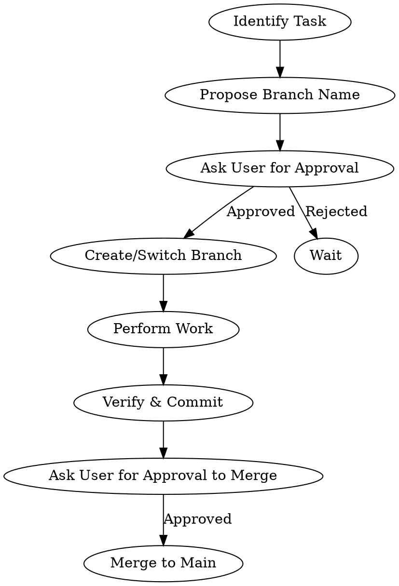

# GitHub Branch Workflow

## Overview
This skill enforces a disciplined Git workflow for all new development tasks. All branching and merging operations require explicit user approval.

## When to Use
- Starting a new feature.
- Beginning work on a distinct project section.
- Any task requiring isolation from the main codebase.

## Workflow

## Mandatory Requirements

1. **Explicit Approval:** NEVER create a branch or merge without asking the user.
2. **Isolation:** Work exclusively in the dedicated branch.
3. **Commit discipline:** Ensure all work is verified before asking to merge.

## Common Mistakes
- Branching without user consent (Violation).
- Merging to main without verification.

## Real-World Impact
- Prevents accidental changes to `main`.
- Keeps work history clean and reviewable.
