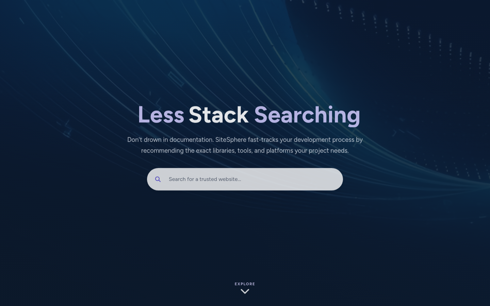
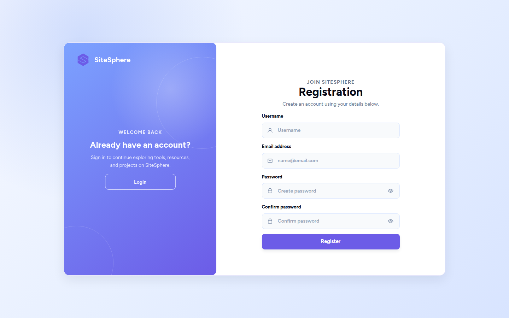
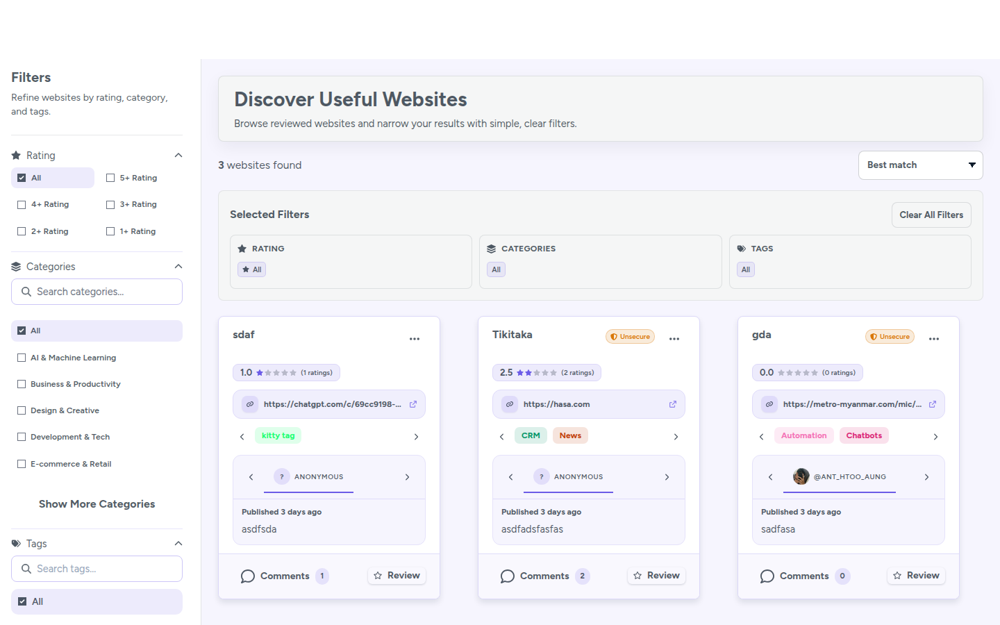
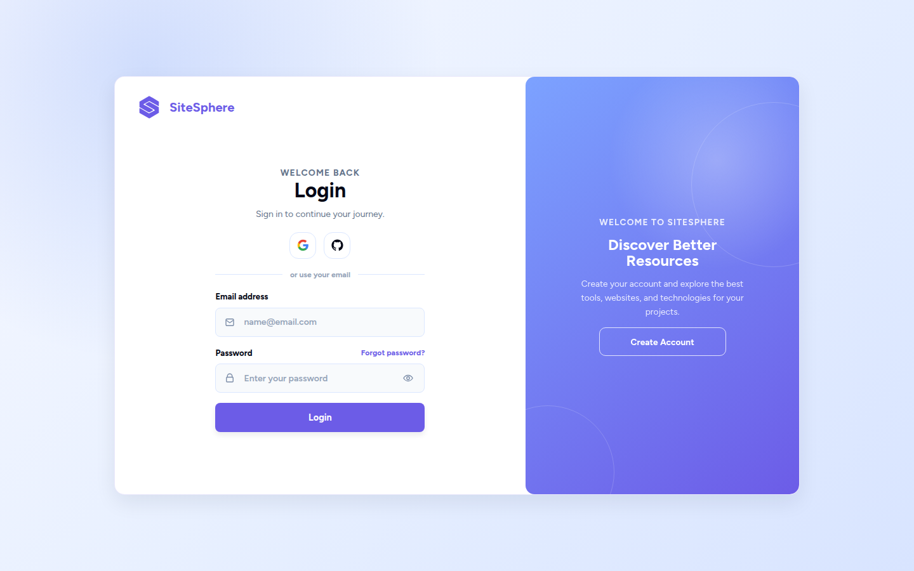
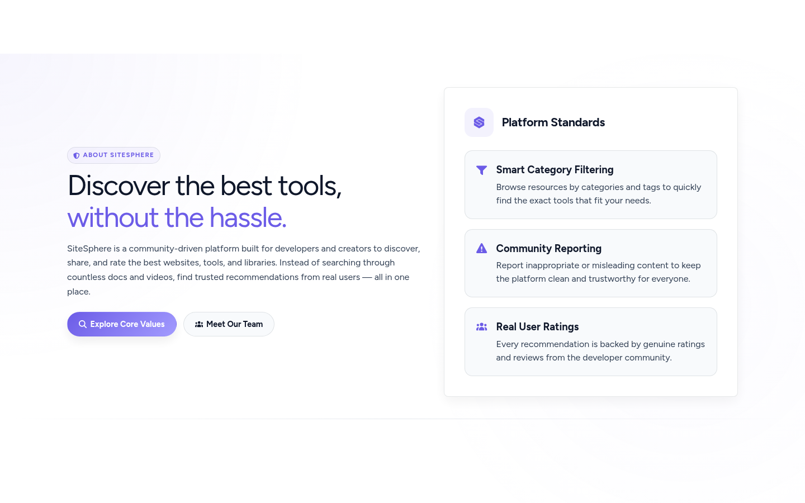
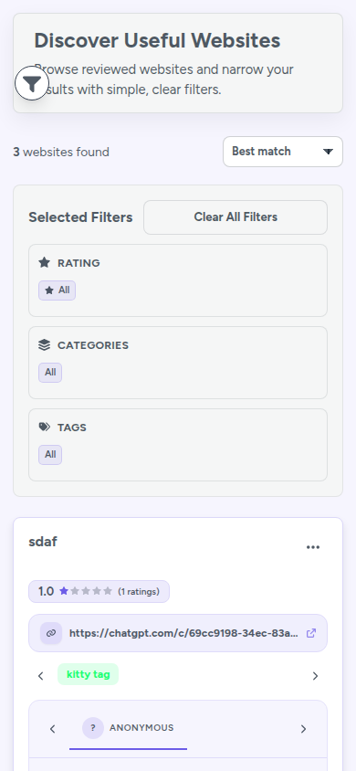

# SiteSphere

> Discover, review, and rate the best development tools and resources — all in one place.


---

## 📸 Screenshots

<table>
  <tr>
    <td align="center"><b>Homepage</b></td>
    <td align="center"><b>Login</b></td>
    <td align="center"><b>Register</b></td>
  </tr>
  <tr>
    <td></td>
    <td></td>
    <td></td>
  </tr>
  <tr>
    <td align="center"><b>Home Feed</b></td>
    <td align="center"><b>Admin Dashboard</b></td>
    <td align="center"><b>Admin Users</b></td>
  </tr>
  <tr>
    <td></td>
    <td></td>
    <td></td>
  </tr>
  <tr>
    <td align="center"><b>Create Post</b></td>
    <td align="center"><b>Edit Profile</b></td>
    <td align="center"><b>Appearance</b></td>
  </tr>
  <tr>
    <td></td>
    <td></td>
    <td></td>
  </tr>
  <tr>
    <td align="center"><b>About Page</b></td>
    <td align="center"><b>Mobile View</b></td>
    <td></td>
  </tr>
  <tr>
    <td></td>
    <td></td>
    <td></td>
  </tr>
</table>

---

## ✨ Features

- 🔍 **Browse & Search** — Find dev tools by category, tag, or keyword
- ⭐ **Rate & Review** — Share your experience with resources
- 👤 **User Profiles** — Track your activity and contributions
- 🏷️ **Tag System** — Filter resources by technology
- 🌙 **Dark/Light Theme** — Comfortable viewing in any environment
- 🔐 **OAuth Login** — Sign in with Google or GitHub
- 📧 **Email Notifications** — Stay updated on activity
- 👑 **Admin Dashboard** — Manage users, content, and categories
- 📱 **Responsive Design** — Works on desktop, tablet, and mobile

---

## 🚀 Quick Start

See **[INSTALL.md](INSTALL.md)** for detailed setup instructions.

### TL;DR

```bash
# Extract and setup
unzip sitesphere.zip
cd sitesphere
composer install
npm install
cp .env.example .env
php artisan key:generate

# Database
touch database/database.sqlite
php artisan migrate --seed

# Build and run
npm run build
php artisan serve
```

Visit **http://localhost:8000**

---

## 🌐 Live Website

**[https://sitesphere-production.site](https://sitesphere-production.site)**

---

## 🛠 Tech Stack

| Layer      | Technology                                    |
|------------|-----------------------------------------------|
| Backend    | PHP 8.3+, Laravel 13                          |
| Frontend   | Tailwind CSS 3, Alpine.js, Vite               |
| Database   | SQLite (dev), MySQL (prod)                    |
| Auth       | Laravel Breeze, Socialite (Google, GitHub)    |
| Email      | Resend                                        |
| Real-time  | Pusher, Laravel Echo                          |
| UI         | Flowbite, SweetAlert2, FontAwesome            |
| Detection  | Jenssegers Agent (mobile/desktop)             |

---

## 👥 Team

| Name | Role | Contribution |
|------|------|--------------|
| Ant Htoo Aung | **Team Leader / Full-Stack** | Backend development, frontend compilation, project architecture |
| Hein Aung Kyaw | Frontend Developer | Login/Register, Post Detail, Logo & Loading, Admin Dashboard |
| Eaint Nadi Kyaw | Frontend Developer | Home Page, Admin Users Page |
| Min Hein Ko | Frontend Developer | Welcome Page, Report View, Flow Charts, Use-Case Diagram |
| Lin Thant Aung | Frontend Developer | Profile Settings, Appearance, AG Design, Security Page |
| Sa Kyaw Wai Yan Htet | Frontend Developer | Saved Posts, Post Card Box, Post Upload |
| Han Htoo Lwin | Frontend Developer | Navigation, Footer, Menu Bar, Report Info |
| Zune Myat Noe | Frontend Developer | About Us, Profile Page, Profile Show Box |

---

## 📄 License

This project is licensed under the MIT License - see the [LICENSE](LICENSE) file.

---

## 👨‍💻 Author

**SiteSphere** — PHP Final Project
